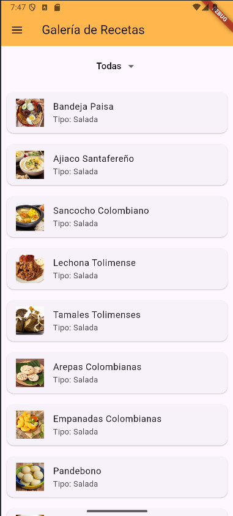

# 📱 Galería de Recetas - App Flutter

Aplicación móvil desarrollada con **Flutter** que permite visualizar una galería de recetas culinarias, con detalles de pasos, imágenes y una navegación amigable mediante un menú lateral. El propósito principal de esta app es poner en práctica conceptos de **Programación Orientada a Objetos (POO)** y **desarrollo de interfaces en Flutter**.

---

## 🧾 Descripción General

Esta aplicación permite a los usuarios:

- Explorar una galería de recetas con imágenes.
- Consultar los pasos detallados para preparar cada receta.
- Navegar entre diferentes secciones como Inicio, Galería de Recetas y Acerca de, a través de un **Drawer (menú lateral)**.

Es una app educativa creada como ejercicio de aprendizaje para mejorar habilidades en Flutter, manejo de widgets, navegación entre pantallas y diseño limpio de interfaces.

---

## 👁️ Vista App
<p align="center">
  
</p>

---

## ✨ Funcionalidades Principales

- 📋 **Visualización de recetas:** Muestra una lista de recetas con imágenes destacadas.
- 📸 **Detalle de receta:** Permite ver los pasos detallados para preparar cada platillo.
- 🍽️ **Clasificación de recetas:** Permite clasificar las recetas según su tipo (Dulce, Salada o Todas).
- 📂 **Drawer personalizado:** Menú lateral para navegar entre las diferentes vistas (Inicio, Galería, Acerca de).

---

## ⚙️ Requisitos del Proyecto

- [Flutter SDK](https://docs.flutter.dev/get-started/install) (versión 3.10 o superior recomendada)
- Dart 3.0 o superior
- Android Studio o VSCode con extensión de Flutter
- Emulador de Android o dispositivo físico para pruebas

---

## 📦 Tecnologías y Paquetes Usados

- **Flutter SDK** – Framework de UI multiplataforma
- **Dart** – Lenguaje de programación principal
- **Material Design** – Conjunto de widgets nativos de Flutter
- **Imágenes remotas** – Se cargan con `Image.network()`
- **Gestión de rutas** – Navegación con `Navigator.pushReplacementNamed`

---

## 🗂️ Estructura del Proyecto

```
recetas_flutter/
├── lib/
│ ├── components/
│ │ ├── app_drawer.dart # Drawer lateral con navegación
│ │ └── Recipe.dart # Modelo de datos para las recetas
│ ├── screens/
│ │ ├── home_screen.dart # (opcional) Pantalla de inicio
│ │ ├── recipes_screen.dart # Pantalla que muestra todas las recetas
│ │ └── about_screen.dart # Pantalla con información del autor y propósito
│ └── main.dart # Punto de entrada principal de la app
├── assets/
│ └── images/ # Carpeta para las imágenes locales
│ └── comida.jpg # Imagen de encabezado del Drawer
├── pubspec.yaml # Configuración del proyecto y dependencias

```
---

## 👤 Autor

Desarrollado por **María José Mendieta Ortiz**   
🌐 https://github.com/MariaJoseMendieta